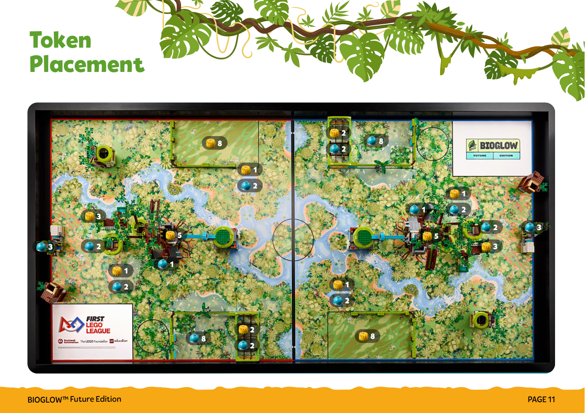
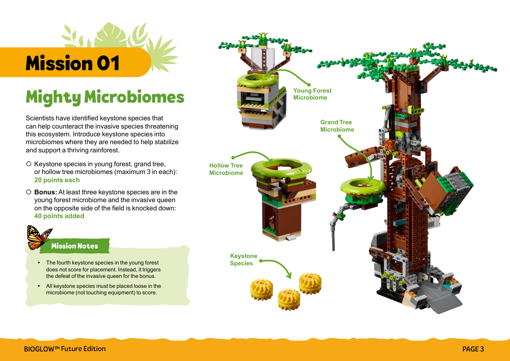
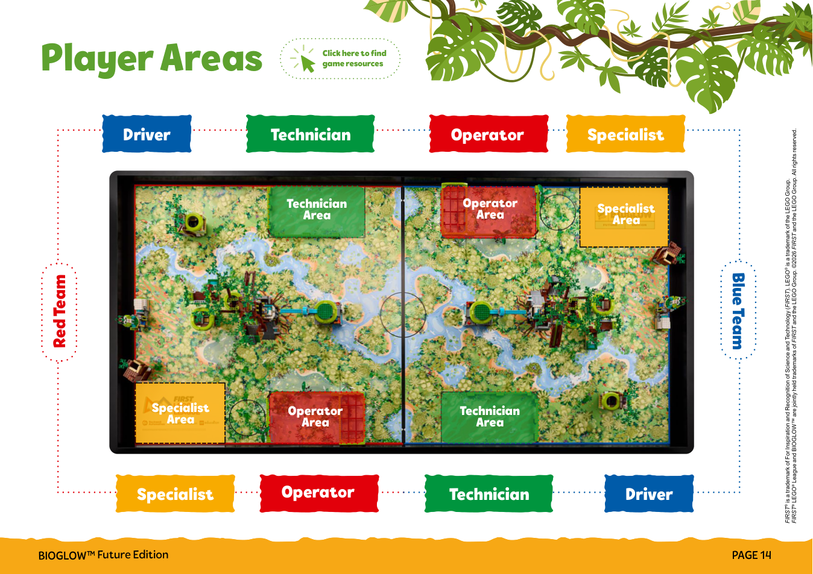
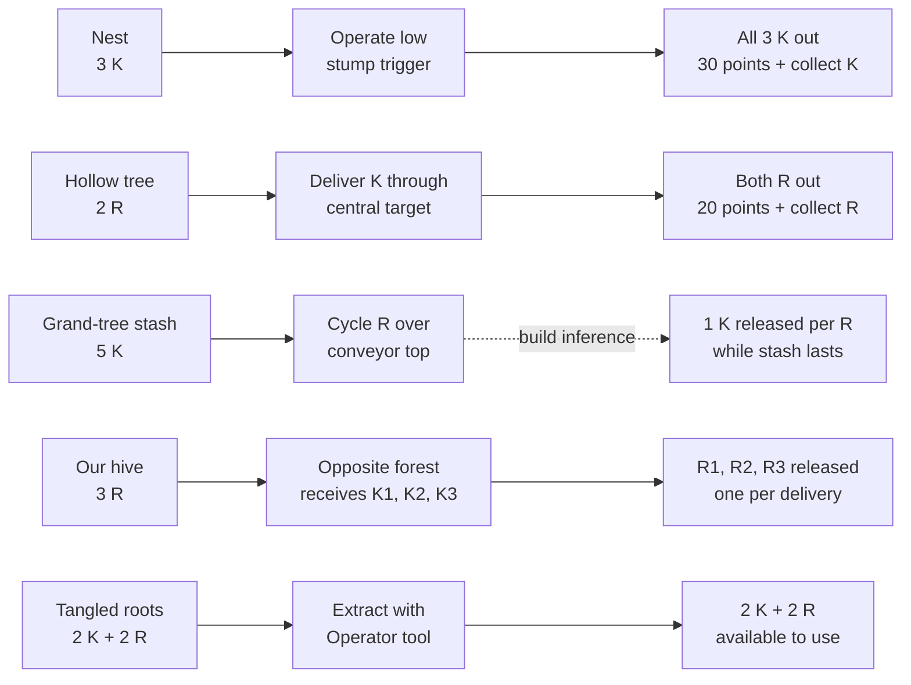
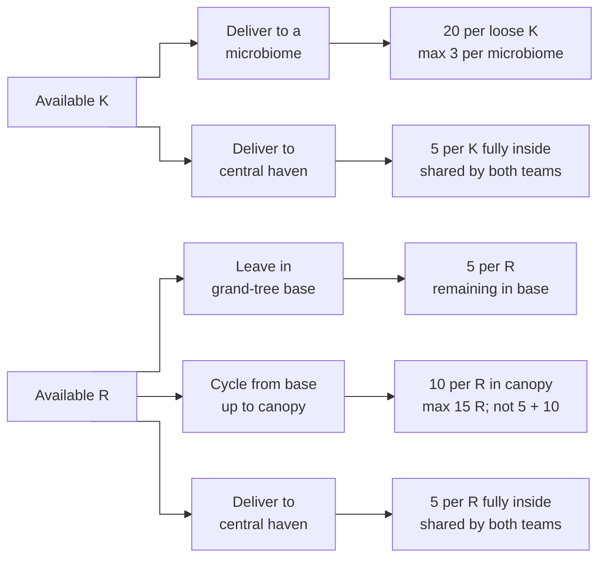
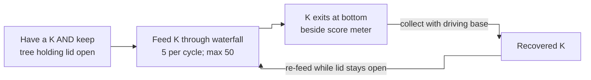
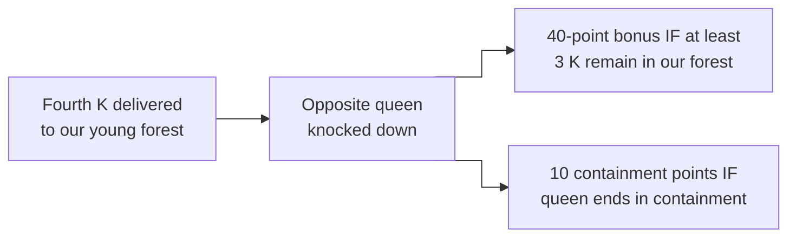

# Where tokens start, what releases them, and what scores

[Home](../README.md) · [Official resource index](../INDEX.md)

BIOGLOW Future Edition, grades 3–8. Checked September 21, 2026. This is a parent/child reference, not an official ruling. Page references below are PDF page numbers.

**Resource availability and dependencies provide a foundation for strategy. There is no single required mission order.** The rulebook explicitly permits any order or combination. Several branches can start immediately, and the four roles can work in parallel.

## 1. Read the actual field

The official token-placement diagram below shows the starting supplies. Red half is left; blue half is right, rotated relative to red. The central haven straddles the join. Yellow tokens are **keystone species (K)**; turquoise tokens are **resources (R)**. Numbers beside icons are starting quantities.

*Source: [Official starting token placement — Field Map, page 11](https://assets.education.lego.com/v3/assets/blt293eea581807678a/blt90d03df02f7a76dc/6a7483f9c2c8ed763808c589/fll-future-3-8-bioglow-field-map.pdf?locale=en-us#page=11). ©2026 FIRST and the LEGO Group. All rights reserved.*

The tree cluster contains distinct destinations: **the grand tree's green-ring microbiome, its resource base, its canopy chamber, and its five-token keystone stash are different places.** A token merely being somewhere on a tree is not enough to score.

*Source: [The three scoring microbiomes — Game Missions, page 3](https://assets.education.lego.com/v3/assets/blt293eea581807678a/blt459e8bb5a19be9e2/6a69a003c5cd7b190e301570/fll-future-3-8-bioglow-game-missions.pdf?locale=en-us#page=3). ©2026 FIRST and the LEGO Group. All rights reserved.*

Player-area boundaries also matter: a token visible on the mat is not necessarily available for a child to pick up by hand. Use the role rules for legal access and handoffs.

*Source: [Official player areas — Field Map, page 14](https://assets.education.lego.com/v3/assets/blt293eea581807678a/blt90d03df02f7a76dc/6a7483f9c2c8ed763808c589/fll-future-3-8-bioglow-field-map.pdf?locale=en-us#page=14). ©2026 FIRST and the LEGO Group. All rights reserved.*

## 2. Complete starting inventory

Quantities below are **per half-field**. Summing the official placements gives **20 K + 20 R**, or **40 K + 40 R across the full field**. These totals are our arithmetic from the diagram, not additional loose supplies.

| Starting location | K | R | What makes these available? | Field Map page |
|---|---:|---:|---|---:|
| Technician area, open supply | 8 | 0 | Ready at the start, subject to role/tool rules. | 10 |
| Operator area, open supply | 0 | 8 | Ready at the start, subject to role/tool rules. | 9 |
| Operator barrier's tangled roots | 2 | 2 | Extract with the Operator tool; do not treat these as loose hand-loadable stock. | 9 |
| Pond just outside Technician area | 1 | 2 | Already loose on the field; collect or move legally. No mission must be completed first. | 10 |
| Pond outside Operator area | 1 | 2 | Already loose on the field; collect or move legally. No mission must be completed first. | 9 |
| Grand tree, upper keystone stash | 5 | 0 | **Strong build-based inference:** R passing over the conveyor top turns the metering gate and releases one K into the opposite chute. Physical one-for-one behavior still to verify; see section 5. | 3 |
| Grand tree base | 0 | 1 | Already loaded for the tree's resource-cycling mechanism. | 3 |
| Nest | 3 | 0 | Activate the nest release; optional invasive piece may add an obstacle. | 5 |
| Hollow tree | 0 | 2 | Official game video demonstrates keystone delivery/release at this model; verify the exact reliable trigger on the built model. | 4 |
| Hive | 0 | 3 | Opposite young forest K1/K2/K3 releases R1/R2/R3; K4 knocks down the queen. Sequence supported by a third-party operating demonstration; see section 5. | 7 |
| **Total** | **20** | **20** | | |

Young forest, cave waterfall, token recycler, and central haven have no additional starting token allocation in that picture. The required invasive queen and optional invasive pieces are separate objects, not K or R tokens.

## 3. Exact scoring checklist

Unless a mission states otherwise, the referee uses the final visible condition when the 2:30 match ends. Moving a token out of a scoring destination can lose those placement points. A release, a transport action, and a scoring placement are three different events.

| Mission | What must be true to score? | Points | Prerequisite / dependency |
|---|---|---|---|
| **1 · Mighty Microbiomes** | K is loose inside the young forest, grand tree, or hollow tree microbiome, not touching equipment. | 20 per K; at most 3 K per microbiome → 60 each / 180 across three. | Obtain and deliver K. Remove an optional cap if it obstructs the target. No requirement to finish a different mission first. |
| **1 · Young forest bonus** | At least 3 K are in the young forest **and the opposite side's invasive queen is knocked down**. | +40 | The fourth K in young forest triggers queen defeat; it earns no additional placement points. Opposite sensor/motor pairing matters. |
| **2 · Roots of Renewal** | R is in the grand tree base. | 5 per R | Deliver R; one starts here already. |
| **2 · Canopy placement** | R is in the canopy chamber **after being cycled up the tree**. Direct placement does not count. | 10 per R, maximum 15 R → 150 | Base → tree cycling → canopy. A given R ending in the canopy earns 10, not 5 + 10. |
| **3 · Cave Waterfall** | K genuinely passes through the waterfall and advances its counter; read counter at the end. | 5 per cycle, maximum 50 → 250 | Access the entrance and feed K. Specialist rotation brings the tree branch against the waterfall lever to swing its lid open. Never advance the counter another way. |
| **4 · Nest release** | **All three** starting K have been released from the nest. | 30 total | Activate release. Releasing only one or two does not meet the “all” condition. |
| **4 · Hollow tree release** | **Both** starting R have been released from the hollow tree. | 20 total | Activate release. Released R can then be collected for another destination. |
| **5 · Central Haven** | K or R rests **completely** in the central haven at match end. | 5 per token; **both teams receive the entire shared score** | Deliver any available tokens. No other mission is required first. |
| **Level Up · Optional invasive setup** | Optional invasive species are added in permitted setup positions, maximum 5. | 20 per added piece → up to 100 | A pre-match difficulty choice, not a token-release reward. |
| **Level Up · Containment** | Invasive species are in the containment zone. | 10 per piece | Remove and deliver the pieces. Merely knocking them over does not earn containment points. The required queen can earn these points, but earns no setup points. |

Sources: Game Missions pp. 3–8; Rulebook p. 3. The table does not replace equipment, interference, and role restrictions.

## 4. Dependencies, without prescribing a strategy

**Read each view left to right.** The views separate token supply, final placement, waterfall reuse, and the forest bonus so connections stay short. Vertical position only separates alternatives; it does **not** mean an earlier/later mission or a dependency level. All arrows use straight segments and right-angle bends. An arrow ends at the box its arrowhead touches; a line leaving that box is a new connection.

Solid arrows are supported by rules, demonstrations, or firsthand observations. The sole dashed arrow marks the grand-tree release inferred from the build drawings. The waterfall reuse loop is our reading of the rules. Reliability and travel time still need practice measurements.

### A. Unlocking additional tokens

Columns: **starting stash → action that unlocks it → released tokens and release points**. Each row is a separate route, not a required mission sequence. Released tokens still need legal collection and delivery before earning placement points in view B.

The initial 8 K at the Technician, 8 R at the Operator, loose pond tokens, and 1 R already in the tree base do not require these unlocks. Optional invasive pieces can obstruct a microbiome target or the nest; removing one is only a prerequisite when it actually blocks the chosen route.

### B. Where tokens can finish for placement points

Columns: **available token → destination/action → scoring condition at match end**. Branches are alternatives for each token. A token cannot occupy two final destinations at once. Tokens from any legal source, including view A, can enter here.

The three microbiomes are the young forest, grand tree, and hollow tree. K must be loose inside and not touching equipment. Direct canopy placement does not score. Cycling R may also release grand-tree K as shown in view A.

### C. Waterfall: score passages, then recover K

The forward path shows **requirements → scoring passage → exit**. The return path explicitly shows collection and re-feeding; it is a loop, not another dependency layer.

The Driver may not collect K by hand. Reuse is supported by our rules interpretation; measure the loop's speed and reliability. Every scored cycle must be a genuine passage, with no direct counter manipulation. Recovered K can instead go to a final destination in view B; waterfall passage does not consume it.

### D. Young forest: queen and bonus

Columns: **trigger → mechanical result → separate scoring opportunities**. The final two branches can both score when their conditions are met; defeating the queen alone does not complete either scoring condition.

The fourth K adds no microbiome placement points beyond the three-K cap. The first three deliveries release R at the **opposite hive**; the mirrored supply route for our own hive appears in view A. Containment still requires legal transport under the role and interference rules.

What this tells us before designing any tools:

- **We do not have to unlock every stash before scoring.** Both token types have substantial starting supplies. Nest-first is an option, not a rule.
- **A release may have two benefits:** its own mission points and more tokens to use elsewhere. For example, releasing both hollow-tree R earns 20; legally collecting and cycling them to the canopy can also earn their final placement points.
- **Scoring destinations compete for tokens at the end.** A K cannot simultaneously rest in a microbiome and in the haven. Waterfall scoring is different: it records completed cycles. The reported bottom exit and a rules review support collecting K with the driving base and cycling it again; no unique-token requirement is stated. The repeat loop still needs timing/reliability measurements and remains subject to the 50-cycle cap.
- **Some gates are physical rather than scoring rules.** The waterfall needs an accessible entrance; there is no stated rule requiring completion of Roots of Renewal first. An optional nest obstacle is not a universal prerequisite.
- **Some dependencies cross the middle of the field.** A young forest sensor controls the opposite hive motor. The young-forest bonus depends on the opposite queen, while haven points are shared by both teams. This is not just four independent roles working on isolated tasks.

## 5. What has been demonstrated, and what remains open

The table below separates official demonstrations, reported physical observations, and build-based inferences. The building-book reference in section 6 also identifies an E2/E3 booklet discrepancy.

| Mechanism | Evidence reviewed | Confidence / next check |
|---|---|---|
| Nest releases 3 K | Official Game Video around 2:45–2:47 shows the low stump-like trigger pressed and tokens released. | Demonstrated. The finger is showing model operation, **not** permission to reach into the field during a match. Test legal tool contact and whether an optional invasive piece obstructs it. |
| Hollow tree releases 2 R | Official Game Video around 2:50–2:52 shows interaction at the green ring, K inside afterward, and R released. Building book 7 shows the linked mechanism. | Demonstrated route, but distinguish it from a written rule requiring a specific prior mission. On the built model, check where K must land and whether one reliable delivery releases both R. |
| Tree rotation opens waterfall access | Book 3 pp. 53–58 and Specialist video show the mechanism. Reported firsthand observation confirms the lid springs closed unless the tree holds it open. | Confirmed maintained-position dependency. Record a reliable holding orientation. No required resource-count threshold is stated. |
| Waterfall exit and reuse | Reported firsthand observation locates the exit at the bottom beside the score meter. Rulebook 14–15 permits tool-based field interaction; Mission 3 counts genuine K cycles without stating a unique-token requirement. | Driving-base collection/re-feeding is supported by our rules interpretation. The Driver may not retrieve by hand. Measure loop time and reliability; no direct counter manipulation. |
| Young forest → opposite hive | Field Map pp. 6–7 and setup video around 8:44 specify opposite-side sensor/motor pairing. Game Missions p. 3 specifies fourth K and queen defeat. | Confirmed. A one-half practice setup must account for the missing opposite model. |
| Grand tree upper 5 K | Book 2 pp. 16–22 shows a paddle/rotor gate, its installation below the magazine, and spring-loaded linkage. Combined book 1+2 pp. 7 and 9 locates it above the conveyor's upper turn and beside the opposite-side exit chute. | **Strong mechanical inference, based on the assembly drawings:** a passing R turns the metering gate, releasing one K to the chute. One-for-one operation and the exact contact point still need physical or video confirmation. This is stronger evidence than the earlier “unknown trigger” label. |
| Hive's 3 R | Field Map p. 7 gives the starting load and opposite-forest connection. Third-party [Next Level Teacher demonstration](https://www.youtube.com/shorts/Yw9Wgl9S70s), opening ~0:00–0:09, shows the successive outputs. | **Demonstrated sequence:** K1 → R1, K2 → R2, K3 → R3, K4 → queen down. Third-party observation consistent with the official queen rule; verify reset/pairing and reliability on the assembled model. |

### Grand tree: build-based explanation checked after the initial guide

The proposed release sequence is consistent with the assembled geometry:

1. An R is lifted from the base toward the canopy.
2. At the conveyor's upper turn, it appears to contact the protruding gray paddle/rotor beneath the vertical K magazine.
3. Turning that rotor moves the metering mechanism; the spring-loaded linkage is consistent with holding/resetting it between releases rather than letting the whole stack fall out.
4. One K is expected to leave the bottom of the stack through the brown chute attached on combined assembly p. 7, opposite the canopy chamber. The R continues toward the canopy.

**Evidence level:** the rotor, magazine, spring linkage, conveyor position, and chute are visible in the drawings. The moving R-to-paddle contact and exact one-K-per-R behavior are inferred from their geometry, not shown in a labeled operating sequence. This should be a dashed dependency in planning, not omitted entirely or described as a confirmed rule.

Expected dependency: **cycle R → canopy placement opportunity + release K → collect K → another K mission**. The K still needs legal collection/delivery; it earns no separate points merely for leaving this particular stash. “One per R” applies only while K remains in the starting five-token supply and the mechanism operates correctly.

Focused bench check: load 5 K, run the conveyor empty, then send 1 R slowly across the top while watching the rotor, spring linkage, K chute, and canopy entrance. Repeat with separately spaced R. Record whether empty cycling releases anything and whether each passing R releases exactly 1 K. This distinguishes resource contact from activation by the conveyor itself.

The grand tree's one-for-one behavior remains a build-based inference pending a working-model check. The hive's release sequence is supported by the linked third-party demonstration, as summarized above.

## 6. Use the correct building book

**Field Map model numbers are not building-book numbers.** Use the mapping below when selecting instructions from the resource index.

| Model | Field Map number | Building book |
|---|---:|---|
| Grand tree | 1 | 1 + 2, then combined assembly sheet; E1 motor |
| Hollow tree | 2 | 7 |
| Nest | 3 | 8 |
| Young forest | 4 | 5; E2 sensor (actual booklet contents) |
| Hive | 5 | 6; E3 motor (actual booklet contents) |
| Token recycler | 6 | 4 |
| Cave waterfall | 7 | 3 |
| Operator barrier | 8 | 9 |
| Technician barrier | 9 | 4 |

See the [resource index](../INDEX.md) for clickable building books.

The Technician Role Card p. 2 reverses the E2/E3 references relative to the actual PDF contents. Follow the actual booklet contents: E2 for the young-forest sensor and E3 for the hive motor.

## Sources

- [Grand tree building book 2](https://assets.education.lego.com/v3/assets/blt293eea581807678a/blt4a68c7940c3294d7/6a69a0400dd9bd280fc21a28/45834_02_BI.pdf?locale=en-us), pp. 16–22 (metering mechanism), and [combined assembly book 1+2](https://assets.education.lego.com/v3/assets/blt293eea581807678a/blt5ec3ce18dcbe021c/6a69a041adf8081a20323d7d/45834_01_and_02_BI.pdf?locale=en-us), pp. 7 and 9 (chute and canopy alignment).
- [Official Field Map](https://assets.education.lego.com/v3/assets/blt293eea581807678a/blt90d03df02f7a76dc/6a7483f9c2c8ed763808c589/fll-future-3-8-bioglow-field-map.pdf?locale=en-us), pp. 2–11 and 14.
- [Official Game Missions](https://assets.education.lego.com/v3/assets/blt293eea581807678a/blt459e8bb5a19be9e2/6a69a003c5cd7b190e301570/fll-future-3-8-bioglow-game-missions.pdf?locale=en-us), pp. 3–8.
- [Official Rulebook](https://assets.education.lego.com/v3/assets/blt293eea581807678a/blt0ab6a9966c6b1311/6a69a004d2b04f14a12a973f/fll-future-3-8-bioglow-rulebook.pdf?locale=en-us), p. 3 (end conditions), pp. 7–11 (roles), p. 14 (any order/combination).
- Official videos: [Game Missions](https://www.youtube.com/watch?v=JDJch3tYZok), [Field Setup](https://www.youtube.com/watch?v=YXyhSA-sfQg), [Specialist role](https://www.youtube.com/watch?v=oiCQPNKU6HU). Selected video segments were reviewed; spoken descriptions alone do not document silent mechanical demonstrations.
- Supplementary third-party evidence: [Next Level Teacher forest/hive demonstration](https://www.youtube.com/shorts/Yw9Wgl9S70s), opening ~0:00–0:09, reviewed September 21, 2026. Supports per-delivery resource release and the subsequent queen release; not an official rule source.
- Reported firsthand observations, September 21, 2026: waterfall lid must remain held open by the tree, or the rubber band closes it; K exits the bottom opening beside the score meter. Collection/reuse legality was separately assessed against Rulebook 14–15 and Mission 3, rather than treated as an observed rule.

The three official page images above are unaltered reference excerpts accompanying the explanations in this noncommercial guide. Copyright remains with FIRST and the LEGO Group; source links accompany each image. This guide is not affiliated with or endorsed by either organization. The dependency diagrams are independent explanations, not official field drawings.
